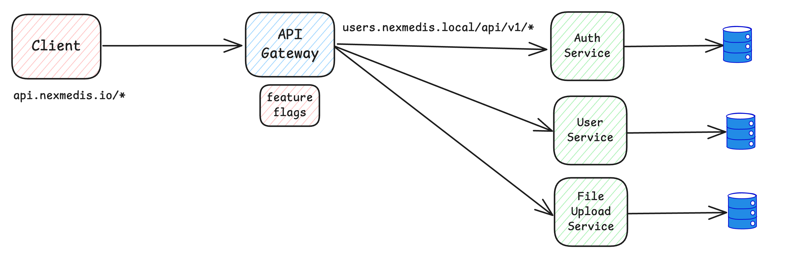

## Refactoring Monolithic Service
You are tasked with refactoring a monolithic service that handles multiple responsibilities such as authentication, file uploads, and user data processing. The system has become slow and hard to maintain. How would you approach refactoring the service?
- What steps would you take to decompose the service into smaller, more manageable services?
- How would you ensure that the new system is backward compatible with the old one during the transition?

## Solution
### Assumptions
Here are some assumptions based on the problem statement:
1. Transforming the monolithic service into microservices with different git repository, deployment process, and it will be rewrite with different language.
2. Client side code and implementation different from this monolithic service.
3. API gateway already used to connect client and these monolitic servce.
4. All functionality will be the same as before including userflow, and API response.
5. For each resposibility already have saparate databases.

### Exisiting Architecture

### Proposed Architecture

### Strategy
**Phase 1: Decomposition**
1. Identify the monolithic service's responsibilities and its dependencies.
2. Create new repositories and microservices for each responsibility.
3. Migrate one service at a time and prioritize based on dependencies and complexity.
4. Create testing scenarios for each service.
5. Create success metrics to measure each service's performance (e.g., response time, error rate).

**Phase 2: Gateway Migration & Reroute Traffic**
1. Implement feature flags on the client side for gradual transition.
2. Configure API gateway to connect the new microservices.
3. Gradually migrate functionality
4. Keep monolith running during transition
5. Route traffic incrementally to new services

**Phase 3: Testing, Monitoring & Deprecate old service**
1. Perform End-to-end testing.
2. Monitor the system's performance and response time via monitoring tool like grafana.
3. Continue realase and reroute traffice to new service until all service is up and running.
4. After all test scenario passed and traffic has been rerouted to new services, dismantle the old service.

### Risk Mitigation
1. Maintan feature flag.
2. Monitoring and alerting.
3. Ceate regular backup database.
4. Create rollback procedure.